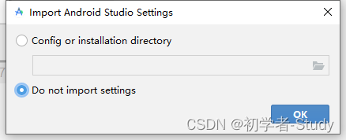
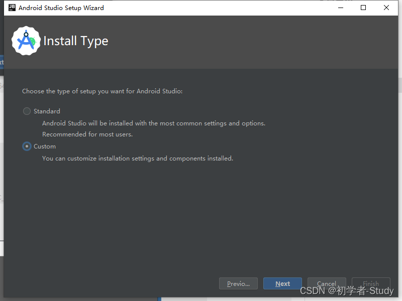
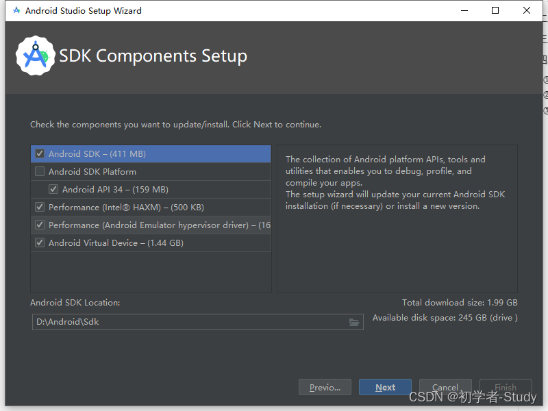
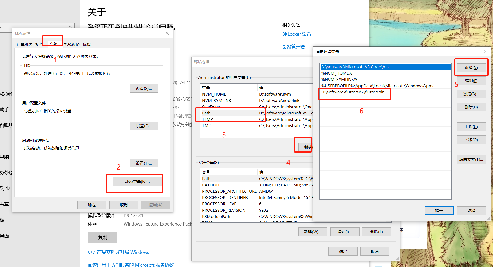

# flutter环境搭建


## 在window电脑系统搭建flutter安卓app

> https://docs.flutter.dev/get-started/install/windows/mobile?tab=download

### 1.开发工具
1. 安装git https://gitforwindows.org/
2. vscode
3. Android Studio https://developer.android.com/studio/install
  - 安装完之后选择`Do no import setting`
<p>
  
</p>

  - SDK下载的时候，选择一些存储地址，不要放到C盘
<p>
  
</p>  

<p>
  
</p>  

4. chorme浏览器

### 2.配置vscode开发工具

- 下载flutter插件`Flutter extension for VS Code.`
https://marketplace.visualstudio.com/items?itemName=Dart-Code.flutter


### 3.安装Flutter SKD
> vscode 使用git按照太慢了，安装zip包，修改环境变量

- 解压文件到`D:\software\fluttersdk`

- 设置环境变量`D:\software\fluttersdk\flutter\bin`
<p>
  
</p>  


### 4.配置安装开发环境

- 安装设置安卓模拟器

1. 启动Android Studio

2. 点击`More Actions` -> ` Device Manager `-> `Create Device`->`x86 Images`->`installed`

 大概就是这些流程，如果有报错就解决报错

 ### 5.检查开发环境设置

 ```
 flutter doctor
 ```

 - 如果报安卓SDK找不到， 可以配置
 ```
flutter config --android-sdk D:\software\androidsdk
 ```

 - 如果报android-studio找不到，可以配置
 ```
 flutter config --android-studio-dir D:\software\android studio
 ```


 ### 6. 创建一个项目

 - 打开Vscode, 打开命令面板(F1 or Ctrl+Shift+P or Shift+Cmd+P)

 - 输入`flutter new`, 选择` Flutter: New Project`命令